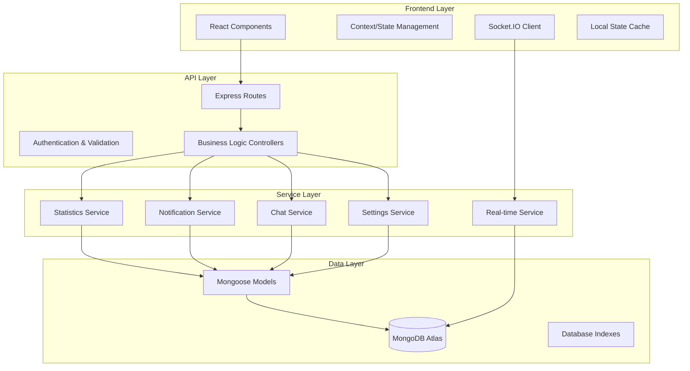
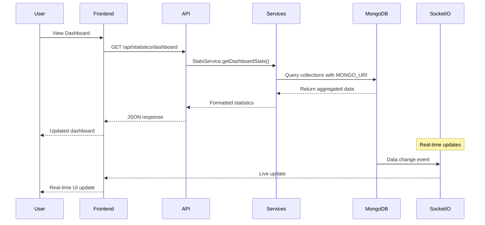

# Design Document

## Overview

This design document outlines the comprehensive solution for fixing critical data display and functionality issues in the neighbourhood watch application. The system currently suffers from incorrect data display (showing zeros instead of actual database values), broken notification functionality, non-functional settings persistence, and chat system failures. 

The design focuses on ensuring all components properly connect to and query the MongoDB Atlas database, implement real-time data updates, and provide robust error handling and user feedback. The solution addresses ten core areas: dashboard statistics accuracy, recent content display, notification system functionality, admin panel data integrity, settings persistence, chat message display, private chat creation, group chat friend integration, database connection consistency, and real-time update mechanisms.

## Architecture

### High-Level System Architecture



### Data Flow Architecture



## Components and Interfaces

### 1. Database Connection Management

#### MongoDB Atlas Connection Service
- **Purpose**: Ensure all database operations use the correct MongoDB Atlas connection
- **Configuration**: Uses MONGO_URI from .env.local file exclusively
- **Interface**:
  ```javascript
  class DatabaseConnection {
    static async connect() {
      const mongoUri = process.env.MONGO_URI;
      if (!mongoUri) {
        throw new Error('MONGO_URI not found in environment variables');
      }
      return mongoose.connect(mongoUri, connectionOptions);
    }
    
    static getConnectionString() {
      return process.env.MONGO_URI;
    }
    
    static isConnected() {
      return mongoose.connection.readyState === 1;
    }
  }
  ```

#### Connection Pool Configuration
- **Pool Size**: Optimized for concurrent requests
- **Timeout Settings**: Configured for MongoDB Atlas latency
- **Retry Logic**: Automatic reconnection with exponential backoff
- **Health Monitoring**: Connection status tracking and alerts

### 2. Dashboard Statistics System

#### Enhanced Statistics Service
- **Purpose**: Provide accurate real-time statistics from MongoDB Atlas
- **Data Sources**: Users, Notices, Reports, ChatGroups, PrivateChats, Messages
- **Interface**:
  ```javascript
  class StatsService {
    async getDashboardStats(userId) {
      const user = await User.findById(userId);
      const [
        activeChatsCount,
        totalNoticesCount,
        openReportsCount,
        neighboursCount
      ] = await Promise.all([
        this.getActiveChatsCount(userId),
        this.getTotalNoticesCount(user.neighbourhoodId),
        this.getOpenReportsCount(user.neighbourhoodId),
        this.getNeighboursCount(user.neighbourhoodId)
      ]);
      
      return {
        activeChats: activeChatsCount,
        totalNotices: totalNoticesCount,
        openReports: openReportsCount,
        neighbours: neighboursCount
      };
    }
    
    async getActiveChatsCount(userId) {
      const [groupChats, privateChats] = await Promise.all([
        ChatGroup.countDocuments({
          'members.userId': userId,
          isActive: true
        }),
        PrivateChat.countDocuments({
          participants: userId,
          isActive: true
        })
      ]);
      return groupChats + privateChats;
    }
    
    async getTotalNoticesCount(neighbourhoodId) {
      return Notice.countDocuments({
        neighbourhoodId,
        status: 'active'
      });
    }
    
    async getOpenReportsCount(neighbourhoodId) {
      return Report.countDocuments({
        neighbourhoodId,
        status: { $in: ['open', 'in-progress'] },
        reportStatus: 'active'
      });
    }
    
    async getNeighboursCount(neighbourhoodId) {
      return User.countDocuments({
        neighbourhoodId,
        isActive: true
      });
    }
  }
  ```

#### Dashboard API Endpoints
- **GET /api/statistics/dashboard**: Returns comprehensive dashboard statistics
- **GET /api/statistics/recent-notices**: Returns recent notices with pagination
- **GET /api/statistics/recent-reports**: Returns recent reports with pagination
- **Caching Strategy**: Short-term caching with real-time invalidation
- **Error Handling**: Graceful fallbacks with default values

### 3. Recent Content Display System

#### Recent Items Service
- **Purpose**: Fetch and format recent notices and reports for dashboard display
- **Data Processing**: Includes author information, timestamps, engagement metrics
- **Interface**:
  ```javascript
  class RecentItemsService {
    async getRecentNotices(neighbourhoodId, limit = 5) {
      return Notice.find({
        neighbourhoodId,
        status: 'active'
      })
      .populate('authorId', 'firstName lastName profileImageUrl')
      .sort({ createdAt: -1 })
      .limit(limit)
      .lean();
    }
    
    async getRecentReports(neighbourhoodId, limit = 5) {
      return Report.find({
        neighbourhoodId,
        reportStatus: 'active'
      })
      .populate('reporterId', 'firstName lastName profileImageUrl')
      .sort({ createdAt: -1 })
      .limit(limit)
      .lean();
    }
    
    formatRecentItems(items, type) {
      return items.map(item => ({
        id: item._id,
        title: item.title,
        author: this.formatAuthor(item.authorId || item.reporterId),
        timeAgo: this.calculateTimeAgo(item.createdAt),
        category: item.category,
        priority: item.priority,
        likes: item.likes?.length || 0,
        comments: item.comments?.length || 0,
        type
      }));
    }
  }
  ```

#### Empty State Handling
- **No Recent Notices**: Display encouraging message to create first notice
- **No Recent Reports**: Display message about community safety
- **Loading States**: Skeleton components during data fetching
- **Error States**: User-friendly error messages with retry options

### 4. Notification System Enhancement

#### Notification Bell Component
- **Real-time Updates**: Socket.IO integration for instant notification updates
- **Icon State Management**: Dynamic icon switching based on unread count
- **Interface**:
  ```javascript
  class NotificationBell {
    constructor() {
      this.unreadCount = 0;
      this.notifications = [];
      this.socket = io();
      this.setupSocketListeners();
    }
    
    setupSocketListeners() {
      this.socket.on('notification:new', (notification) => {
        this.handleNewNotification(notification);
      });
      
      this.socket.on('notification:read', (notificationId) => {
        this.handleNotificationRead(notificationId);
      });
    }
    
    async fetchUnreadCount() {
      const response = await fetch('/api/notifications/unread-count');
      const data = await response.json();
      this.updateUnreadCount(data.count);
    }
    
    async fetchNotifications() {
      const response = await fetch('/api/notifications?limit=10');
      const data = await response.json();
      this.updateNotifications(data.notifications);
    }
    
    async markAsRead(notificationId) {
      await fetch(`/api/notifications/${notificationId}/read`, {
        method: 'PUT'
      });
      this.updateLocalNotificationState(notificationId);
    }
    
    async markAllAsRead() {
      await fetch('/api/notifications/mark-all-read', {
        method: 'PUT'
      });
      this.clearAllNotifications();
    }
  }
  ```

#### Notification Service Backend
- **Database Operations**: CRUD operations for notifications
- **Real-time Broadcasting**: Socket.IO event emission
- **Notification Types**: Friend requests, messages, likes, comments, system notifications
- **Interface**:
  ```javascript
  class NotificationService {
    async createNotification(recipientId, type, content, reference) {
      const notification = new Notification({
        recipient: recipientId,
        type,
        content,
        reference,
        read: false
      });
      
      await notification.save();
      
      // Broadcast real-time update
      this.socketService.emitToUser(recipientId, 'notification:new', notification);
      
      return notification;
    }
    
    async getUnreadCount(userId) {
      return Notification.countDocuments({
        recipient: userId,
        read: false
      });
    }
    
    async getUserNotifications(userId, options = {}) {
      const { limit = 10, offset = 0 } = options;
      
      return Notification.find({ recipient: userId })
        .populate('reference.id')
        .sort({ createdAt: -1 })
        .limit(limit)
        .skip(offset);
    }
    
    async markAsRead(notificationId, userId) {
      const notification = await Notification.findOneAndUpdate(
        { _id: notificationId, recipient: userId },
        { read: true, readAt: new Date() },
        { new: true }
      );
      
      if (notification) {
        this.socketService.emitToUser(userId, 'notification:read', notificationId);
      }
      
      return notification;
    }
  }
  ```

### 5. Admin Panel Data Management

#### Admin Data Service
- **Purpose**: Provide comprehensive data access for administrative functions
- **Data Aggregation**: Real-time statistics and user management data
- **Interface**:
  ```javascript
  class AdminDataService {
    async getAdminDashboardData() {
      const [
        userStats,
        contentStats,
        systemStats,
        recentActivity
      ] = await Promise.all([
        this.getUserStatistics(),
        this.getContentStatistics(),
        this.getSystemStatistics(),
        this.getRecentActivity()
      ]);
      
      return {
        users: userStats,
        content: contentStats,
        system: systemStats,
        activity: recentActivity
      };
    }
    
    async getUserStatistics() {
      const [total, active, suspended, banned, admins, moderators] = await Promise.all([
        User.countDocuments(),
        User.countDocuments({ status: 'active' }),
        User.countDocuments({ status: 'suspended' }),
        User.countDocuments({ status: 'banned' }),
        User.countDocuments({ role: 'admin' }),
        User.countDocuments({ role: 'moderator' })
      ]);
      
      return { total, active, suspended, banned, admins, moderators };
    }
    
    async getContentStatistics() {
      const [notices, reports, messages, chats] = await Promise.all([
        this.getNoticeStatistics(),
        this.getReportStatistics(),
        this.getMessageStatistics(),
        this.getChatStatistics()
      ]);
      
      return { notices, reports, messages, chats };
    }
  }
  ```

#### Admin Control Interface
- **User Management**: Role changes, suspensions, bans
- **Content Moderation**: Notice/report approval, removal, editing
- **System Monitoring**: Database health, performance metrics
- **Audit Logging**: All admin actions tracked with timestamps

### 6. Settings Persistence System

#### Settings Service
- **Purpose**: Handle user preference storage and retrieval
- **Real-time Updates**: Immediate database persistence
- **Interface**:
  ```javascript
  class SettingsService {
    async getUserSettings(userId) {
      const user = await User.findById(userId).select('settings');
      return user?.settings || this.getDefaultSettings();
    }
    
    async updateNotificationSettings(userId, notificationSettings) {
      const user = await User.findById(userId);
      if (!user) throw new Error('User not found');
      
      // Merge with existing settings
      user.settings.notifications = {
        ...user.settings.notifications,
        ...notificationSettings
      };
      
      await user.save();
      return user.settings.notifications;
    }
    
    async updatePrivacySettings(userId, privacySettings) {
      const user = await User.findById(userId);
      if (!user) throw new Error('User not found');
      
      user.settings.privacy = {
        ...user.settings.privacy,
        ...privacySettings
      };
      
      await user.save();
      return user.settings.privacy;
    }
    
    async updateInterfaceSettings(userId, interfaceSettings) {
      const user = await User.findById(userId);
      if (!user) throw new Error('User not found');
      
      user.settings.interface = {
        ...user.settings.interface,
        ...interfaceSettings
      };
      
      await user.save();
      return user.settings.interface;
    }
  }
  ```

#### Settings Frontend Component
- **Optimistic Updates**: Immediate UI feedback with rollback on error
- **Error Handling**: Clear error messages and state recovery
- **Validation**: Client and server-side validation
- **Interface**:
  ```javascript
  class SettingsComponent {
    async handleSettingChange(category, setting, value) {
      const originalValue = this.state.settings[category][setting];
      
      // Optimistic update
      this.updateLocalSetting(category, setting, value);
      
      try {
        await this.saveSettingToServer(category, setting, value);
        this.showSuccessMessage();
      } catch (error) {
        // Rollback on error
        this.updateLocalSetting(category, setting, originalValue);
        this.showErrorMessage(error.message);
      }
    }
    
    async saveSettingToServer(category, setting, value) {
      const endpoint = this.getSettingsEndpoint(category);
      const payload = { [setting]: value };
      
      const response = await fetch(endpoint, {
        method: 'PUT',
        headers: { 'Content-Type': 'application/json' },
        body: JSON.stringify(payload)
      });
      
      if (!response.ok) {
        throw new Error('Failed to save setting');
      }
      
      return response.json();
    }
  }
  ```

### 7. Chat System Restoration

#### Message Display Service
- **Purpose**: Retrieve and display chat messages from database
- **Real-time Updates**: Socket.IO integration for live messaging
- **Interface**:
  ```javascript
  class MessageService {
    async getGroupMessages(groupId, userId, options = {}) {
      // Verify user membership
      const group = await ChatGroup.findOne({
        _id: groupId,
        'members.userId': userId,
        isActive: true
      });
      
      if (!group) {
        throw new Error('Access denied or group not found');
      }
      
      const { limit = 50, before } = options;
      const query = {
        chatId: groupId,
        chatType: 'group',
        moderationStatus: 'active'
      };
      
      if (before) {
        query.createdAt = { $lt: new Date(before) };
      }
      
      return Message.find(query)
        .populate('senderId', 'firstName lastName profileImageUrl')
        .sort({ createdAt: -1 })
        .limit(limit);
    }
    
    async getPrivateMessages(chatId, userId, options = {}) {
      // Verify user is participant
      const privateChat = await PrivateChat.findOne({
        _id: chatId,
        participants: userId,
        isActive: true
      });
      
      if (!privateChat) {
        throw new Error('Access denied or chat not found');
      }
      
      const { limit = 50, before } = options;
      const query = {
        chatId,
        chatType: 'private',
        moderationStatus: 'active'
      };
      
      if (before) {
        query.createdAt = { $lt: new Date(before) };
      }
      
      return Message.find(query)
        .populate('senderId', 'firstName lastName profileImageUrl')
        .sort({ createdAt: -1 })
        .limit(limit);
    }
    
    async sendMessage(chatId, chatType, senderId, content) {
      const message = new Message({
        chatId,
        chatType,
        senderId,
        content,
        status: 'sent',
        moderationStatus: 'active'
      });
      
      await message.save();
      await message.populate('senderId', 'firstName lastName profileImageUrl');
      
      // Broadcast to chat participants
      this.socketService.emitToChat(chatId, 'message:new', message);
      
      return message;
    }
  }
  ```

#### Private Chat Creation Service
- **Purpose**: Handle private chat creation and friend verification
- **Error Handling**: Detailed error messages for troubleshooting
- **Interface**:
  ```javascript
  class PrivateChatService {
    async createPrivateChat(userId, friendId) {
      // Verify friendship exists
      const user = await User.findById(userId);
      const isFriend = user.friends.includes(friendId);
      
      if (!isFriend) {
        throw new Error('Can only create private chats with friends');
      }
      
      // Check if chat already exists
      let privateChat = await PrivateChat.findOne({
        participants: { $all: [userId, friendId] }
      });
      
      if (!privateChat) {
        privateChat = new PrivateChat({
          participants: [userId, friendId],
          isActive: true
        });
        
        await privateChat.save();
      }
      
      await privateChat.populate('participants', 'firstName lastName profileImageUrl');
      return privateChat;
    }
    
    async getFriendsList(userId) {
      const user = await User.findById(userId)
        .populate('friends', 'firstName lastName profileImageUrl status');
      
      return user.friends.filter(friend => friend.status === 'active');
    }
  }
  ```

### 8. Real-time Update System

#### Socket.IO Integration
- **Purpose**: Provide real-time updates across all application features
- **Event Types**: Messages, notifications, statistics, settings changes
- **Interface**:
  ```javascript
  class RealTimeService {
    constructor(io) {
      this.io = io;
      this.userSockets = new Map(); // userId -> socketId mapping
    }
    
    handleConnection(socket) {
      socket.on('user:authenticate', (userId) => {
        this.userSockets.set(userId, socket.id);
        socket.join(`user:${userId}`);
      });
      
      socket.on('disconnect', () => {
        this.removeUserSocket(socket.id);
      });
    }
    
    emitToUser(userId, event, data) {
      this.io.to(`user:${userId}`).emit(event, data);
    }
    
    emitToChat(chatId, event, data) {
      this.io.to(`chat:${chatId}`).emit(event, data);
    }
    
    broadcastStatisticsUpdate(neighbourhoodId) {
      this.io.to(`neighbourhood:${neighbourhoodId}`).emit('statistics:update');
    }
  }
  ```

#### Update Propagation Strategy
- **Database Triggers**: MongoDB change streams for real-time detection
- **Event Broadcasting**: Targeted updates to relevant users
- **Client Handling**: Automatic UI updates without page refresh
- **Conflict Resolution**: Last-write-wins with user notification

## Data Models

### Enhanced User Model (Settings Focus)
```javascript
const UserSchema = {
  // ... existing fields
  settings: {
    notifications: {
      email: { type: Boolean, default: true },
      push: { type: Boolean, default: true },
      friendRequests: { type: Boolean, default: true },
      messages: { type: Boolean, default: true },
      chatNotifications: { type: Boolean, default: true },
      reportNotifications: { type: Boolean, default: true }
    },
    privacy: {
      profileVisibility: { 
        type: String, 
        enum: ['public', 'neighbours', 'friends', 'private'],
        default: 'neighbours'
      },
      messagePermissions: {
        type: String,
        enum: ['everyone', 'neighbours', 'friends', 'none'],
        default: 'friends'
      }
    },
    interface: {
      sidebarExpanded: { type: Boolean, default: false },
      darkMode: { type: Boolean, default: false },
      language: { type: String, default: 'en' }
    },
    locationSharing: { type: Boolean, default: false }
  }
}
```

### Enhanced Notification Model
```javascript
const NotificationSchema = {
  recipient: { type: ObjectId, ref: 'User', required: true },
  type: {
    type: String,
    enum: ['friendRequest', 'message', 'like', 'comment', 'system', 'report', 'notice'],
    required: true
  },
  title: { type: String, required: true },
  content: { type: String, required: true },
  read: { type: Boolean, default: false },
  readAt: { type: Date },
  reference: {
    type: { type: String, enum: ['user', 'message', 'notice', 'report', 'chat'] },
    id: { type: ObjectId }
  },
  sender: { type: ObjectId, ref: 'User' },
  createdAt: { type: Date, default: Date.now },
  updatedAt: { type: Date, default: Date.now }
}
```

### Message Model Enhancement
```javascript
const MessageSchema = {
  // ... existing fields
  moderationStatus: {
    type: String,
    enum: ['active', 'archived', 'removed'],
    default: 'active'
  },
  readBy: [{
    userId: { type: ObjectId, ref: 'User' },
    readAt: { type: Date, default: Date.now }
  }]
}
```

## Error Handling

### Database Connection Errors
- **Connection Failures**: Automatic retry with exponential backoff
- **Query Timeouts**: Graceful degradation with cached data
- **Network Issues**: Offline mode with queue synchronization
- **Authentication Errors**: Clear error messages and re-authentication flow

### API Error Responses
```javascript
class ErrorHandler {
  static handleDatabaseError(error, req, res, next) {
    if (error.name === 'MongoNetworkError') {
      return res.status(503).json({
        error: 'Database temporarily unavailable',
        message: 'Please try again in a moment',
        code: 'DB_NETWORK_ERROR'
      });
    }
    
    if (error.name === 'ValidationError') {
      return res.status(400).json({
        error: 'Invalid data provided',
        details: error.errors,
        code: 'VALIDATION_ERROR'
      });
    }
    
    // Generic database error
    return res.status(500).json({
      error: 'Database operation failed',
      message: 'An unexpected error occurred',
      code: 'DB_OPERATION_ERROR'
    });
  }
}
```

### Frontend Error Handling
- **Network Errors**: Retry mechanisms with user feedback
- **Data Loading Errors**: Skeleton states with retry options
- **Real-time Connection Errors**: Automatic reconnection with status indicators
- **Settings Save Errors**: Rollback with clear error messages

## Testing Strategy

### Database Integration Testing
- **Connection Testing**: Verify MongoDB Atlas connectivity
- **Query Performance**: Test with realistic data volumes
- **Error Scenarios**: Network failures, timeout handling
- **Data Consistency**: Verify CRUD operations accuracy

### Real-time Feature Testing
- **Socket.IO Testing**: Connection, disconnection, event handling
- **Multi-user Scenarios**: Concurrent user interactions
- **Message Delivery**: Ensure reliable message transmission
- **Notification Broadcasting**: Verify targeted delivery

### End-to-End Testing
- **Dashboard Flow**: Complete statistics display workflow
- **Chat Functionality**: Message sending and receiving
- **Settings Persistence**: Save and load user preferences
- **Admin Operations**: User management and content moderation

### Performance Testing
- **Database Query Optimization**: Index usage and query performance
- **Real-time Scalability**: Multiple concurrent connections
- **Memory Usage**: Monitor for memory leaks in long-running sessions
- **Response Times**: Ensure sub-second response times

## Implementation Phases

### Phase 1: Database Connection Standardization
1. Audit all database connections to ensure MONGO_URI usage
2. Implement connection pooling and error handling
3. Add connection health monitoring
4. Test database connectivity across all services

### Phase 2: Dashboard Statistics Fix
1. Implement enhanced StatsService with accurate queries
2. Update dashboard API endpoints
3. Add real-time statistics updates
4. Implement error handling and fallbacks

### Phase 3: Notification System Restoration
1. Fix notification bell icon switching logic
2. Implement notification dropdown functionality
3. Add real-time notification updates
4. Test notification creation and reading

### Phase 4: Settings System Implementation
1. Fix settings loading from database
2. Implement immediate save functionality
3. Add optimistic updates with rollback
4. Test all settings categories

### Phase 5: Chat System Restoration
1. Fix message display for group and private chats
2. Implement private chat creation
3. Add friend availability for group chats
4. Test real-time messaging functionality

### Phase 6: Admin Panel Data Integration
1. Implement comprehensive admin data service
2. Connect admin panel to real database queries
3. Add admin control functionality
4. Test user and content management features

### Phase 7: Real-time Updates Implementation
1. Implement Socket.IO event system
2. Add real-time updates for all dynamic content
3. Test multi-user real-time scenarios
4. Optimize performance and reliability

### Phase 8: Testing and Optimization
1. Comprehensive integration testing
2. Performance optimization
3. Error handling verification
4. User acceptance testing