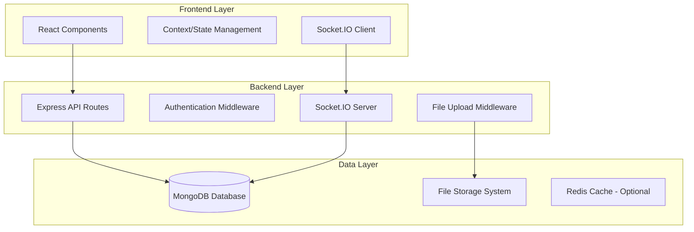
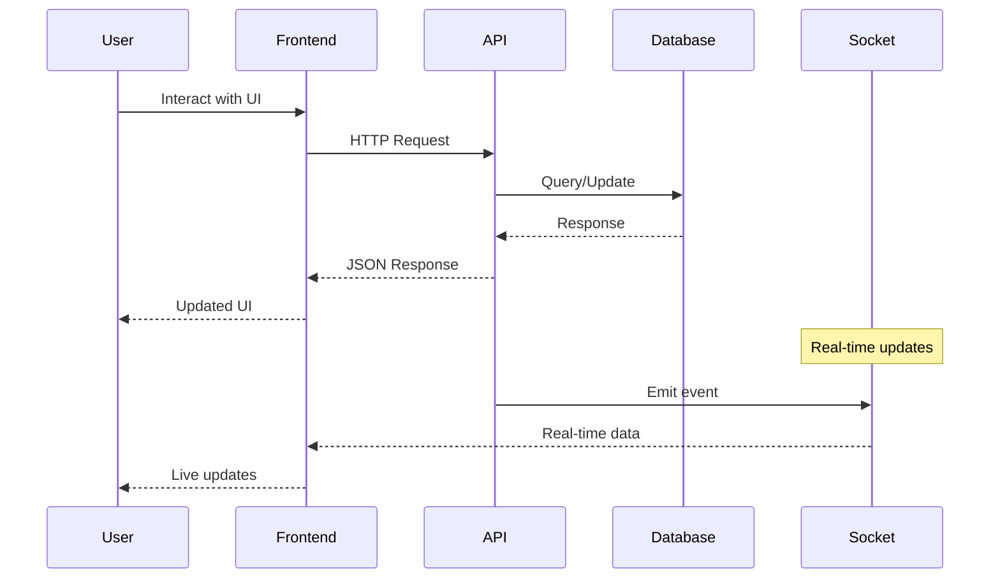

# Design Document

## Overview

This design document outlines the comprehensive cleanup and enhancement of the neighbourhood watch app. The system will be transformed from a prototype with mock data into a fully functional, database-driven application with advanced social features, real-time communication, and administrative capabilities.

The design focuses on eleven core areas: data layer cleanup, media handling, user interface enhancements, social networking features, administrative controls, search functionality, real-time messaging, visual improvements, notification system, collapsible sidebar navigation, and legal compliance.

## Architecture

### High-Level Architecture



### Data Flow Architecture



## Components and Interfaces

### 1. Data Layer Cleanup Components

#### Mock Data Removal Service
- **Purpose**: Systematically identify and remove all hardcoded mock data
- **Interface**: 
  ```javascript
  class DataCleanupService {
    scanForMockData(directory)
    replaceMockWithAPI(component, apiEndpoint)
    validateDataIntegrity(component)
  }
  ```

#### Statistics Aggregation Service
- **Purpose**: Calculate real-time statistics from database collections
- **Interface**:
  ```javascript
  class StatsService {
    getUserStats(userId)
    getCommunityStats(neighbourhoodId)
    getEngagementMetrics(contentType)
    calculateTimeSince(timestamp)
  }
  ```

### 2. Media Upload Components

#### File Upload Middleware
- **Technology**: Multer with file validation
- **Interface**:
  ```javascript
  const uploadConfig = {
    storage: multer.diskStorage({...}),
    fileFilter: validateFileType,
    limits: { fileSize: 10MB }
  }
  ```

#### Media Display Components
- **Components**: ImageViewer, VideoPlayer, MediaGallery
- **Features**: Lazy loading, responsive sizing, error handling

### 3. Social Networking Components

#### Friend System
- **Models**: FriendRequest, Friendship
- **Interface**:
  ```javascript
  class FriendService {
    sendFriendRequest(fromUserId, toUserId)
    acceptFriendRequest(requestId)
    getFriends(userId)
    getFriendRequests(userId)
  }
  ```

#### Private Messaging System
- **Real-time**: Socket.IO integration
- **Interface**:
  ```javascript
  class PrivateMessageService {
    createPrivateChat(user1Id, user2Id)
    sendPrivateMessage(chatId, senderId, message)
    getPrivateChats(userId)
  }
  ```

### 4. Search System

#### Search Service
- **Technology**: MongoDB text search with aggregation
- **Interface**:
  ```javascript
  class SearchService {
    searchAll(query, userId)
    searchUsers(query)
    searchContent(query, type)
    getAutocompleteResults(query)
  }
  ```

#### Search UI Component
- **Features**: Autocomplete dropdown, grouped results, keyboard navigation
- **Interface**:
  ```jsx
  <SearchBar
    onSearch={handleSearch}
    onSelect={handleResultSelect}
    placeholder="Search people, notices, reports..."
  />
  ```

### 5. Administrative Components

#### Admin Control Panel
- **Features**: Content moderation, user management, system monitoring
- **Interface**:
  ```javascript
  class AdminService {
    moderateContent(contentId, action)
    manageUser(userId, action)
    getAuditLog()
    getSystemStats()
  }
  ```

#### User Management System
- **Features**: Role management (user, moderator, admin), suspension, banning
- **Permissions**: Role-based access control with graduated privileges

### 6. UI Enhancement Components

#### Layout System
- **Responsive Design**: CSS Grid and Flexbox
- **Header Compensation**: Dynamic height calculation
- **Interface**:
  ```css
  .app-body {
    height: calc(100vh - var(--header-height));
    overflow-y: auto;
  }
  ```

#### Navigation Enhancement
- **Separate Tabs**: Neighbours vs Friends
- **Dynamic Counters**: Real-time count updates

#### Floating Action Button (FAB)
- **Design**: Material Design inspired
- **Animation**: Smooth expand/collapse
- **Actions**: Quick create options

### 7. Real-time Messaging Enhancement

#### Message Display System
- **Immediate Updates**: Optimistic UI updates
- **Real-time Sync**: Socket.IO integration
- **Interface**:
  ```javascript
  class MessageService {
    sendMessage(chatId, message)
    updateMessageStatus(messageId, status)
    handleIncomingMessage(message)
  }
  ```

#### Emoji Integration
- **Library**: animated-fluent-emojis
- **Features**: Picker component, animation controls
- **Interface**:
  ```jsx
  <EmojiPicker
    onEmojiSelect={handleEmojiSelect}
    animationBehavior="hover"
    size={32}
  />
  ```

### 8. Visual Enhancement System

#### Icon System
- **Source**: 3dicons.co collection
- **Implementation**: SVG sprites or individual imports
- **Consistency**: Standardized sizing and colors

### 9. Collapsible Sidebar System

#### Sidebar Component
- **Default State**: Collapsed to approximately 50px width showing only icons
- **Expanded State**: Full width showing icons and text labels
- **Tooltip System**: Displays name of menu items on hover when collapsed
- **Interface**:
  ```jsx
  <Sidebar
    defaultCollapsed={true}
    showTooltips={true}
    mobileBreakpoint={768}
  />
  ```

#### Mobile Adaptation
- **Bottom Navigation**: Convert sidebar to bottom navigation on mobile
- **Hamburger Menu**: Additional menu items accessible via hamburger menu in topBar

### 10. Notification System

#### Notification Service
- **Types**: Friend requests, messages, content engagement, system notifications
- **Storage**: MongoDB with real-time updates via Socket.IO
- **Interface**:
  ```javascript
  class NotificationService {
    createNotification(userId, type, content, reference)
    markAsRead(notificationId)
    markAllAsRead(userId)
    getUnreadCount(userId)
    getNotifications(userId, options)
  }
  ```

#### Notification UI Components
- **Bell Icon**: Shows unread count badge
- **Dropdown**: Displays notifications in chronological order
- **Sound**: Configurable notification sounds
- **Push Notifications**: Web, iOS, Android, and Huawei support
- **Interface**:
  ```jsx
  <NotificationBell
    count={unreadCount}
    onClick={toggleDropdown}
    soundEnabled={soundEnabled}
  />
  
  <NotificationDropdown
    notifications={notifications}
    onMarkAllRead={handleMarkAllRead}
    onNotificationClick={handleNavigate}
  />
  ```

### 11. Legal Compliance System

#### Terms and Conditions Modals
- **Notice Board Terms**: Guidelines prohibiting solicitation, advertising, etc.
- **Report Terms**: Guidelines requiring factual information, sources, etc.
- **Acceptance Tracking**: Database storage of user acceptance
- **Interface**:
  ```jsx
  <TermsModal
    type="noticeBoard"
    onAccept={handleAccept}
    onDecline={handleDecline}
    alreadyAccepted={userAcceptedTerms}
  />
  ```

#### Legal Documents
- **Terms of Service**: Comprehensive usage terms
- **Privacy Policy**: Data handling and POPIA compliance
- **Storage**: Versioned documents with acceptance tracking
- **Interface**:
  ```javascript
  class LegalDocumentService {
    getDocument(type, version)
    recordAcceptance(userId, documentType, version)
    checkAcceptance(userId, documentType)
    getLatestVersion(documentType)
  }
  ```

#### Welcome Messages
- **Empty State Components**: Guidance for new users
- **Collapsible Introductions**: Feature explanations that remember state
- **Interface**:
  ```jsx
  <WelcomeMessage
    type="chat"
    collapsible={true}
    onDismiss={handleDismiss}
    showAgain={!userDismissedWelcome}
  />
  ```

## Data Models

### Enhanced User Model
```javascript
const UserSchema = {
  _id: ObjectId,
  username: String,
  email: String,
  password: String, // hashed
  profile: {
    firstName: String,
    lastName: String,
    avatar: String, // file path
    bio: String,
    joinDate: Date
  },
  role: {
    type: String,
    enum: ['user', 'moderator', 'admin'],
    default: 'user'
  },
  status: {
    type: String,
    enum: ['active', 'suspended', 'banned'],
    default: 'active'
  },
  settings: {
    notifications: {
      email: Boolean,
      push: Boolean,
      sound: Boolean,
      friendRequests: Boolean,
      messages: Boolean
    },
    privacy: {
      profileVisibility: String,
      messagePermissions: String
    },
    interface: {
      sidebarExpanded: Boolean,
      darkMode: Boolean
    }
  },
  legalAcceptance: {
    termsOfService: {
      accepted: Boolean,
      version: String,
      timestamp: Date
    },
    privacyPolicy: {
      accepted: Boolean,
      version: String,
      timestamp: Date
    },
    noticeBoardTerms: {
      accepted: Boolean,
      timestamp: Date
    },
    reportTerms: {
      accepted: Boolean,
      timestamp: Date
    }
  },
  dismissedWelcomeMessages: {
    chat: Boolean,
    noticeBoard: Boolean,
    reports: Boolean
  },
  friends: [ObjectId], // references to User
  neighbourhoodId: ObjectId,
  createdAt: Date,
  updatedAt: Date
}
```

### Friend Request Model
```javascript
const FriendRequestSchema = {
  _id: ObjectId,
  from: ObjectId, // User reference
  to: ObjectId, // User reference
  status: {
    type: String,
    enum: ['pending', 'accepted', 'declined'],
    default: 'pending'
  },
  createdAt: Date,
  updatedAt: Date
}
```

### Private Chat Model
```javascript
const PrivateChatSchema = {
  _id: ObjectId,
  participants: [ObjectId], // User references (always 2)
  lastMessage: {
    content: String,
    sender: ObjectId,
    timestamp: Date
  },
  createdAt: Date,
  updatedAt: Date
}
```

### Enhanced Message Model
```javascript
const MessageSchema = {
  _id: ObjectId,
  chatId: ObjectId, // ChatGroup or PrivateChat reference
  chatType: {
    type: String,
    enum: ['group', 'private']
  },
  sender: ObjectId, // User reference
  content: String,
  emojis: [String], // emoji identifiers
  media: [{
    type: String, // 'image' or 'video'
    url: String,
    filename: String
  }],
  status: {
    type: String,
    enum: ['sent', 'delivered', 'read'],
    default: 'sent'
  },
  createdAt: Date,
  updatedAt: Date
}
```

### Enhanced Notice/Report Models
```javascript
const NoticeSchema = {
  _id: ObjectId,
  title: String,
  content: String,
  author: ObjectId, // User reference
  media: [{
    type: String,
    url: String,
    filename: String
  }],
  likes: [ObjectId], // User references
  comments: [{
    author: ObjectId,
    content: String,
    createdAt: Date
  }],
  status: {
    type: String,
    enum: ['active', 'archived', 'removed'],
    default: 'active'
  },
  neighbourhoodId: ObjectId,
  createdAt: Date,
  updatedAt: Date
}
```

### Notification Model
```javascript
const NotificationSchema = {
  _id: ObjectId,
  recipient: ObjectId, // User reference
  type: {
    type: String,
    enum: ['friendRequest', 'message', 'like', 'comment', 'system', 'report', 'notice']
  },
  title: String,
  content: String,
  read: {
    type: Boolean,
    default: false
  },
  reference: {
    type: {
      type: String,
      enum: ['user', 'message', 'notice', 'report', 'chat', 'system']
    },
    id: ObjectId // Reference to the related document
  },
  createdAt: Date,
  updatedAt: Date
}
```

### Legal Document Model
```javascript
const LegalDocumentSchema = {
  _id: ObjectId,
  type: {
    type: String,
    enum: ['termsOfService', 'privacyPolicy', 'noticeBoardTerms', 'reportTerms']
  },
  version: String,
  content: String,
  active: Boolean,
  createdAt: Date,
  updatedAt: Date
}
```

## Error Handling

### Client-Side Error Handling
- **Network Errors**: Retry mechanisms with exponential backoff
- **Validation Errors**: Real-time form validation with user feedback
- **File Upload Errors**: Progress indicators and error recovery
- **Socket Disconnection**: Automatic reconnection with status indicators

### Server-Side Error Handling
- **Database Errors**: Graceful degradation and logging
- **Authentication Errors**: Proper HTTP status codes and messages
- **File System Errors**: Cleanup and rollback mechanisms
- **Rate Limiting**: Prevent abuse with proper error responses

### Error Recovery Strategies
```javascript
class ErrorHandler {
  handleNetworkError(error) {
    // Implement retry logic
    // Show user-friendly messages
    // Cache failed requests for retry
  }
  
  handleValidationError(error) {
    // Display field-specific errors
    // Prevent form submission
    // Guide user to correction
  }
  
  handleFileUploadError(error) {
    // Show upload progress
    // Allow retry or cancel
    // Clean up partial uploads
  }
}
```

## Testing Strategy

### Unit Testing
- **Components**: React Testing Library for UI components
- **Services**: Jest for business logic and API services
- **Models**: Mongoose model validation testing
- **Utilities**: Pure function testing

### Integration Testing
- **API Endpoints**: Supertest for HTTP endpoint testing
- **Database Operations**: Test database with seed data
- **Socket.IO**: Real-time communication testing
- **File Uploads**: Multer middleware testing

### End-to-End Testing
- **User Flows**: Cypress for complete user journeys
- **Real-time Features**: Socket connection and message flow
- **Admin Functions**: Role-based access and permissions
- **Mobile Responsiveness**: Cross-device testing

### Performance Testing
- **Database Queries**: Query optimization and indexing
- **File Upload Performance**: Large file handling
- **Real-time Scalability**: Multiple concurrent users
- **Search Performance**: Text search optimization

### Testing Data Strategy
```javascript
const testDataFactory = {
  createUser: (overrides) => ({ ...defaultUser, ...overrides }),
  createFriendship: (user1, user2) => ({ ... }),
  createPrivateChat: (participants) => ({ ... }),
  createNoticeWithMedia: (author, mediaFiles) => ({ ... })
}
```

## Implementation Phases

### Phase 1: Data Layer Cleanup (Requirements 1, 8)
1. Remove all mock data from components
2. Implement real-time statistics calculation
3. Update all counters to use database queries
4. Add proper error handling for data fetching

### Phase 2: Media Upload System (Requirement 2)
1. Implement multer middleware for file uploads
2. Add media fields to existing models
3. Create file upload UI components
4. Implement media display components

### Phase 3: Social Features (Requirements 9, 10)
1. Implement friend request system
2. Create private messaging functionality
3. Add friend management UI
4. Integrate real-time notifications

### Phase 4: UI Enhancements (Requirements 4, 5, 12, 13)
1. Fix layout sizing issues
2. Implement clickable dashboard cards
3. Create floating action button
4. Separate Neighbours and Friends navigation

### Phase 5: Search System (Requirement 14)
1. Implement backend search functionality
2. Create autocomplete search UI
3. Add grouped search results
4. Optimize search performance

### Phase 6: Real-time Messaging (Requirements 15, 16)
1. Enhance chat interface for immediate updates
2. Integrate emoji picker with animated-fluent-emojis
3. Implement optimistic UI updates
4. Add message status indicators

### Phase 7: Admin Features (Requirements 6, 7, 11)
1. Create admin user account
2. Implement user promotion system
3. Add content moderation tools
4. Create admin dashboard

### Phase 8: Visual Polish (Requirement 17)
1. Integrate 3D icons throughout the app
2. Ensure consistent visual design
3. Add loading states and animations
4. Optimize performance

### Phase 9: Collapsible Sidebar (Requirement 18)
1. Implement collapsible sidebar component
2. Add tooltip system for collapsed state
3. Create mobile-responsive adaptation
4. Add hamburger menu for additional options on mobile

### Phase 10: Notification System (Requirement 19)
1. Create notification data model and service
2. Implement notification bell with dropdown
3. Add real-time notification updates
4. Implement sound and push notifications
5. Create notification preferences in settings

### Phase 11: Welcome Messages and Guidance (Requirement 20)
1. Create welcome message components for empty states
2. Implement collapsible introduction messages
3. Add state persistence for dismissed messages
4. Create consistent UI for guidance components

### Phase 12: Terms and Conditions (Requirement 21)
1. Create terms and conditions modals
2. Implement acceptance tracking
3. Add content creation permission checks
4. Create terms content for notice board and reports

### Phase 13: Legal Documents (Requirement 22)
1. Create legal document models and services
2. Implement Terms of Service and Privacy Policy
3. Add POPIA compliance information
4. Create acceptance tracking during signup
5. Add links to legal documents in settings